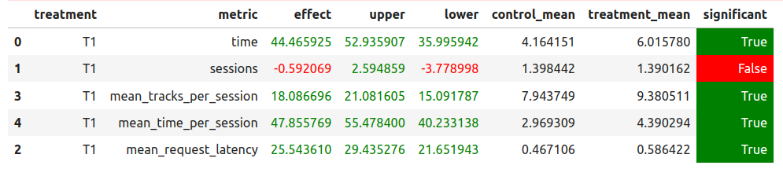

### Подготовка данных

В папке ./data должен находиться файл data.csv. 

* Его можно скачать по ссылке [данные для обучения](https://disk.yandex.ru/d/SN0_STc0rE6a_w), 
* либо подготовить его самостоятельно. Для этого вам понадобятся собранные логи сервиса botify. 
По ссылке [логи](https://disk.yandex.ru/d/QC1y_9ErfWMm6w) вы можете скачать архив с ранее собранными логами. 
Блокнот `./notebook/PrepareData.ipynb` поможет преобразовать логи в данные для обучения
* Можете самостоятельно собрать логи. На сбор 20 млн.записей ушло 16 часов

### Обучение

* В папке `./experiments/recommender-track` лежит уже обученная модель. Процесс ее обучения можете 
посмотреть в [ClearML](https://app.clear.ml/projects/8a3351bc2d20466d954ea92902184f42/experiments/1f1403e93cf3414d8e5dddb184fb24cf/output/execution).
Ссылка доступна только для зарегистрированных в `ClearML` пользователей

* Вы можете самостоятельно запустить цикл обучения. Перед запуском настройте [ClearML](https://app.community.clear.ml/)
Обучение запускается командой `make.train`. Время ожидания результата 2 часа

### Подготовка рекомендаций для сервиса botify

* `./data/recommendations_hw02_track.json` - это файл с подготовленными рекомендациями
* Для самостоятельного создания файла с рекомендациями запустите команду `make infer`

### Результаты A/B эксперимента

* Для запуска эксперимента используйте блокнот `./notebook/ABtest.ipynb` и собранные в рамках эксперимента логи

Здесь представлены результаты успешного A/B теста. В контроле показан STICKY_ARTIST, а в тритменте - мой рекоммендер.
Логи эксперимента собирались в 2 потока по 2500 сессий

